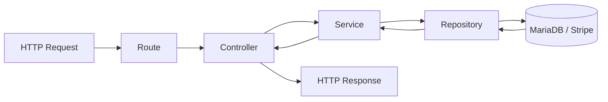

# API REST · Human Perform

> Backend productivo para una app móvil de gestión deportiva (usuarios, reservas, productos y pagos).
> Diseñado como proyecto de portfolio para mostrar criterios de **arquitectura**, **seguridad**, **integración de pagos** y **calidad de software** en un entorno realista.


---

## 🎯 Valor de portfolio (qué demuestra este proyecto)

Este backend enseña habilidades especialmente relevantes para contratación en roles backend/full-stack:

- **Diseño de APIs REST mantenibles** (recursos, subrecursos, versionado implícito por prefijos).
- **Autenticación robusta** con `access token` + `refresh token` y middleware de autorización.
- **Lógica de negocio no trivial**: reservas con reglas, gestión de productos/servicios y cartera de usuario.
- **Integración con terceros** (Stripe: intents, subscriptions, métodos de pago, webhook).
- **Calidad y fiabilidad** con pruebas unitarias e integración automatizadas.
- **Observabilidad básica** con logging estructurado para errores y eventos críticos.

---

## 🧱 Arquitectura

El proyecto está organizado por capas de responsabilidad:

```text
routes/        # Contrato HTTP y rutas
controllers/   # Adaptadores HTTP (request/response)
services/      # Reglas de negocio
repositories/  # Persistencia e integraciones externas
middlewares/   # Seguridad y concerns transversales
config/        # Entorno, DB, Stripe
utils/         # Helpers y logging
tests/         # Unit + integration
```

### Flujo backend



---

## 🔐 Seguridad y autenticación

- Rutas privadas protegidas con `verifyToken` (Bearer JWT).
- Flujo de sesión completo:
  - `POST /api/mobile/sessions` (login)
  - `POST /api/mobile/tokens/refresh` (renovación)
  - `DELETE /api/mobile/sessions/current` (logout)
- Subida de archivos con middlewares dedicados para foto y documentos.

---

## 📚 Dominios funcionales de la API

| Dominio | Ejemplos |
|---|---|
| Core | `/api/ping`, `/api/health`, `/api/docs`, `/api/openapi.yaml` |
| Auth | `/api/mobile/users`, `/api/mobile/sessions`, `/api/mobile/tokens/refresh` |
| User | perfil, foto, cupones, documentos, stats, e-wallet, suscripciones |
| Services/Products | catálogo, asignación/desasignación y detalle de producto activo |
| Booking | disponibilidad diaria, creación/edición/cancelación de reservas, festivos |
| Stripe | customer, payment methods, payment intents, refunds, subscriptions, webhook |

> 📌 Para ver cada endpoint con detalle de payloads y respuestas, consulta `docs/openapi.yaml` o `GET /api/docs`.

---

## ⚙️ Stack técnico

- **Runtime**: Node.js 18+
- **Framework**: Express 5
- **Base de datos**: MariaDB (`mysql2/promise`)
- **Auth**: `jsonwebtoken`, `bcrypt`
- **Pagos**: Stripe SDK
- **Uploads/Media**: `multer`, `sharp`
- **Testing**: Jest + Supertest
- **Logging**: Pino

---

## 🚀 Quickstart

### 1) Requisitos

- Node.js `>=18`
- MariaDB en ejecución

### 2) Instalar dependencias

```bash
npm install
```

### 3) Configurar `.env` en la raíz

```bash
PORT=8085
NODE_ENV=development

DB_HOST=localhost
DB_PORT=3306
DB_USER=root
DB_PASSWORD=
DB_NAME=human_app

JWT_SECRET=change_me
JWT_REFRESH_SECRET=change_me_too

STRIPE_SECRET_KEY=sk_test_xxx
STRIPE_WEBHOOK_SECRET=whsec_xxx
STRIPE_PUBLISHABLE_KEY=pk_test_xxx
```

### 4) Ejecutar

```bash
npm run dev
# o
npm start
```

---

## 🧪 Testing

```bash
npm test
npm run test:integration
```

Este repositorio incluye pruebas unitarias y de integración para validar casos felices y errores de negocio.

---

## 📖 Documentación incluida en el repo

- OpenAPI: `docs/openapi.yaml`
- Swagger UI (runtime): `/api/docs`
- Guía de URIs REST: `docs/api-uri-guidelines.md`
- Richardson maturity assessment: `docs/richardson-maturity-assessment.md`
- Test quality report: `docs/test-quality-report.md`

---

## 📄 Licencia

MIT. Ver `LICENSE`.
