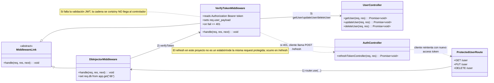

# Diagrama de clases (Mermaid) — Chain of Responsibility en este proyecto

Este diagrama está aterrizado a cómo funciona **este backend Express**:

- En rutas protegidas (por ejemplo `GET /user`), la cadena real es:
  1) middleware de inyección de DB (`router.use`),
  2) middleware `verifyToken`,
  3) controlador final (`getUser`, `updateUser`, etc.).
- Si `verifyToken` falla, responde `401` y **no** se ejecuta el controlador.
- El refresh token se resuelve en otra ruta (`POST /refresh`), y el cliente reintenta la ruta protegida con el nuevo access token.

## Referencia directa a archivos del proyecto

- Middleware JWT: `middlewares/verifyToken.js`
- Cadena en rutas de usuario: `routes/user.routes.js`
- Controlador protegido ejemplo: `controllers/user.controller.js`
- Flujo refresh token: `routes/auth.routes.js` + `controllers/auth.controller.js`
